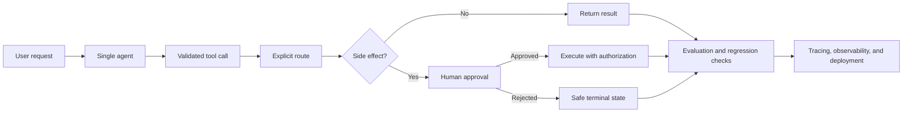

# Architecture Map

The lab grows from the smallest controllable loop toward production operations.

The guiding rule is to introduce complexity only when the simpler pattern no longer satisfies the requirement. Each pattern must document its boundary, failure modes, and evaluation strategy.
