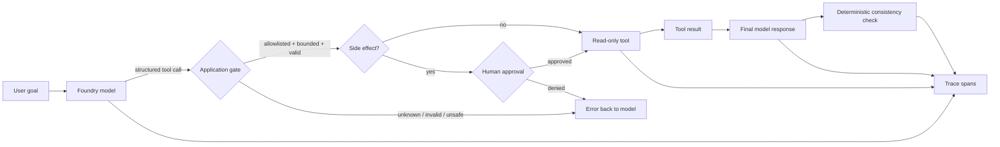

# From Agent Demo to Production Boundary: Making Tool Calling Trustworthy

**Canonical article:** `https://amrelsehemy.net/` *(publish this article on the website and replace with its final URL)*  
**Implementation:** [Agentic Engineering Lab](https://github.com/AmrElsehemy/agentic-engineering-lab)  
**Status:** Verified live against Microsoft Foundry and Azure Monitor on 4 October 2026 (three consecutive passing evaluator runs)

## The claim

Most agent examples prove that a model can call a function. That is useful, but it is not the production problem.

The production problem is whether the application can create a **trustworthy boundary between probabilistic model behavior and deterministic software behavior**.

This article focuses on one aspect of production-grade agent engineering:

> **Controlled tool execution: the model may propose an action, but application code decides whether that action is allowed, valid, observable, and safe to hand back to the model.**

This is deliberately narrower than claiming that a small repository is production-ready in every dimension. It does not solve distributed state, incident response, privacy review, load testing, or business authorization. It does establish and test one boundary that every serious agent system needs.

## Why another tool-calling demo is not enough

A typical demo looks like this:

1. Send a prompt to a model.
2. Give the model a function definition.
3. Execute whatever function it requests.
4. Send the result back.
5. Print the answer.

That proves an API integration. It does not answer the questions an engineering team asks before operating the system:

- Can the model invoke an unapproved tool?
- Can it make multiple calls when only one was intended?
- Are arguments bounded and validated before execution?
- Can a tool create a side effect without a human or policy decision?
- Can we distinguish a model response from a tool execution in telemetry?
- Can the final prose contradict the structured result?
- Can a regression test fail when the model changes behavior?
- Can we run the same control checks without calling a model?

The Agentic Engineering Lab treats those questions as the actual unit of work. The model is only one component in the loop.

## The production boundary

The first example has two deliberately modest tools: `get_training_plan`, which is read-only, and `save_plan`, which has a side effect.

Neither touches a real business system. `save_plan` appends to a local file. That is intentional: it is the smallest possible side effect, which is enough to show where the decision to allow it must live.

The model chooses whether to call a tool at all. An earlier version of this example forced the tool call, and the first live trace showed why that was not a real test: the model never decided anything, it only filled in arguments, and it filled in `"athlete": "Unknown"`, a value the user never gave. That passed schema validation. Schema-valid is not the same as grounded in what the user said.



The important part is the application gate. The model does not receive authority merely because it produced syntactically valid JSON.

**Rendered diagram:** [Controlled tool boundary](../diagrams/rendered/controlled-tool-boundary.png)

**Editable source:** [controlled-tool-boundary.mmd](../diagrams/controlled-tool-boundary.mmd)

## Control 1: allowlist the tool surface

The tool surface is explicit. The example authorizes `get_training_plan` and `save_plan` and rejects unknown tools before execution. The rejection is returned to the model as an error result, so the loop continues instead of crashing.

That distinction matters because tool definitions are not a security policy. They are instructions to a model. The application still needs its own policy boundary.

A useful production rule is:

> **Every tool call must pass an application-owned authorization check, even when the model was given the same tool in its prompt.**

This also creates a clean place to add policy later: tenant permissions, data classification, environment restrictions, approval requirements, and rate limits.

## Control 2: bound and validate arguments

The tool validates the arguments it receives:

- Arguments must be a JSON object with exactly `goal` and `days_available`. Malformed JSON, extra keys and missing keys are rejected.
- `days_available` must be an integer between 1 and 7. Booleans and numeric strings are rejected.
- The goal is bounded before it reaches the model loop.
- The result contains exactly the requested number of sessions.

Rejected calls go back to the model as errors, never into the tool. The first live trace also changed the design: `athlete` was removed, `days_available` became required with no default, and the prompt tells the model to ask when the user has not given a number of days. Validation checks shape and range; it cannot prove a value came from the user. The live evaluator therefore has a scenario that gives no days and asserts that no tool runs.

This is not about distrusting one model vendor. It is about treating model output as untrusted input, just as we would treat a request from a browser, webhook, or third-party integration.

The validation is also testable without a live model. That is a key design choice: the policy should not depend on model availability or prompt luck.

## Control 3: enforce a tool-call budget

The example allows one tool call per turn and at most four model calls per request, and the last call runs with tools disabled so the loop always ends in an answer. That is a small but meaningful operational control.

Without a budget, a model can produce multiple calls, duplicate work, or create a surprising fan-out. A production system may eventually need a richer budget—per request, per user, per workflow, and per tool—but the principle is the same:

> **Tool execution is a metered operation, not an unlimited side effect of generation.**

Extra calls in one turn are skipped and answered with an error, so the model can ask again if it still needs them.

## Control 4: make the handoff observable

The execution emits structured events rather than relying on a single opaque log line:

```json
{"event":"model_response","step":1,"tool_calls":[{"name":"get_training_plan","arguments":"<redacted>"}]}
{"event":"tool_executed","tool":"get_training_plan","validated":true,"side_effect":false,"outcome":"ok"}
{"event":"model_response","step":2,"tool_calls":[]}
{"event":"quality_check","name":"training_plan_consistency","passed":true}
```

Arguments, results and content are redacted unless local debugging is explicitly enabled. A trace that leaks the user's prompt is its own incident.

In the live Microsoft Foundry run, the same loop was traced with Entra-authenticated Azure Monitor export:

```json
{"event":"observability_configured","backend":"azure-monitor"}
```

The trace is useful because it separates four different facts:

1. What the model proposed.
2. What the application allowed and executed.
3. What the model generated after receiving the tool result.
4. Whether a deterministic postcondition passed.

That separation is the beginning of diagnosability. If the final answer is wrong, the team can ask whether the model proposed the wrong call, the tool returned the wrong data, the handoff was malformed, or the final response contradicted the tool result.

**Rendered diagram:** [Foundry and Azure Monitor evidence path](../diagrams/rendered/foundry-azure-monitor-evidence.png)

**Editable source:** [foundry-azure-monitor-evidence.mmd](../diagrams/foundry-azure-monitor-evidence.mmd)

## Control 5: test the final answer against structured truth

A subtle failure mode appears after the tool has executed successfully: the model can still describe a different result in its final prose.

For the training-plan example, the structured tool result contains `days_available`. The quality guard scans explicit schedule claims in the final response and rejects a contradiction such as:

```text
Tool result: 4 days
Final answer: a 5-day plan
```

This is not a complete quality evaluation. It is a deterministic postcondition for one important invariant.

The broader pattern is reusable:

- Tool result says the account is not eligible; final answer must not say it is eligible.
- Tool result says approval is pending; final answer must not imply execution completed.
- Tool result says inventory is zero; final answer must not promise shipment.
- Tool result says a deployment failed; final answer must not report success.

The exact invariant changes by domain. The architecture does not.

## Control 6: require a human decision for side effects

`save_plan` changes state, so it is not allowed to run on the model's say-so. The application asks a human, and the default answer is no: with no interactive terminal, the approval is denied.

Three details matter more than the prompt itself:

- **Validation happens before approval.** A human is never asked to approve a call that would have been rejected anyway.
- **The model does not author what is persisted.** `save_plan` regenerates the plan from the validated arguments instead of storing model-written text.
- **A denial is a result, not a crash.** It goes back to the model as an error, and in the live run the model told the user it could not save without approval. Nothing was written.

The side effect is also idempotent: saving an identical plan twice writes one record. This came from the live runs, where repeated approved saves appended identical lines.

Here is the part this example does not solve. The approval is a terminal prompt from whoever runs the script. There is no approver identity, no authorization model, and no durable audit log. That is the gap between a control point and a production control, and it is the next piece of work, not a footnote.

## Failure modes this boundary catches

The value of the controls becomes clearer when the failure modes are made explicit.

### The model requests an unknown tool

The model may hallucinate a function name, follow an outdated instruction, or receive a tool list that is broader than the current application policy. The allowlist rejects the call before execution. The result is a controlled failure rather than an accidental dispatch.

### The model supplies invalid arguments

Structured tool calls improve shape, but they do not guarantee acceptable values. A model can request seven sessions when a particular workflow permits three, send an empty goal, or exceed a bounded input size. Validation keeps those values at the application boundary.

### The model invents an argument

The first live trace produced `"athlete": "Unknown"`. It was well-formed, in range, and not what the user said. The mitigation is layered and only partly deterministic: remove fields the model has no source for, make the rest required, instruct the model to ask, and test the behavior live. A prompt is a mitigation, not a guarantee, and the live evaluator reports outcomes, not grounding.

### The model asks for a side effect nobody approved

The call is validated, the human is asked, and a denial is returned as an error. The test that matters is the negative one: after a `no`, nothing is written.

### The model produces multiple calls

Multiple calls may be valid in a future workflow, but they should be an explicit design choice. The one-call budget makes accidental fan-out visible and fails closed. A later orchestration example can replace the budget with a state machine and per-step policy rather than silently relaxing the control.

### The final prose drifts from the tool result

This is easy to miss because the response may sound helpful. The consistency guard turns a semantic invariant into a testable event. It does not judge every sentence; it catches the specific class of contradiction that the application has declared unacceptable.

### Telemetry is unavailable or misconfigured

The Azure Monitor check is separate from the model-quality check. If tracing cannot initialize, the live evaluator fails with an infrastructure diagnosis rather than pretending that observability exists. This distinction matters operationally: a system can produce a correct answer while still being unsafe to operate if no one can reconstruct what happened.

## Why the side effect is small, and what is still missing

It is tempting to demonstrate production seriousness by connecting an agent directly to a real business system. That often makes the example less rigorous. A real side effect introduces authorization, idempotency, rollback, audit, retry, privacy, and reconciliation questions all at once. If those are not designed, the demo creates the appearance of autonomy without the controls required to contain it.

So the side effect here is a local file, chosen to make the approval boundary testable rather than to look impressive. What it covers: a default-deny human decision, validation before approval, application-owned persisted content, and idempotency. What it does not cover: who the approver is and whether they are entitled to approve, a durable audit trail, retries and recovery, and anything that cannot be undone. Those come before any consequential business tool.

## What an operating team can reuse

The most reusable artifact is not the training-plan domain. It is the contract around execution. A team could replace `get_training_plan` with a pricing lookup, document classifier, deployment planner, or support-ticket triage tool while keeping the same control questions:

| Boundary question | Example implementation |
|---|---|
| Is the capability allowed? | Application-owned tool allowlist |
| Are inputs safe to process? | Type, range, length, and domain validation |
| How much work may happen? | Per-turn call budget |
| What happened? | Structured model, tool, final, and quality events |
| What must remain true? | Deterministic postcondition checks |
| Can operators investigate? | Entra-authenticated Azure Monitor traces |
| What happens with side effects? | Default-deny human approval after validation; idempotent write |

This is why the article is useful beyond a demo. It provides a small, inspectable template for a control plane that can grow with the domain. The business tool changes; the burden of proof around that tool remains.

## What was actually verified

On 4 October 2026, the example was run against a Microsoft Foundry project using Microsoft Entra authentication and deployment `gpt-5.4-nano`, with Azure Monitor tracing configured.

The live evaluator ran three times in a row. Each run passed all four scenarios:

```text
LIVE PASS tool used when a plan is requested
LIVE PASS asks instead of inventing missing days
LIVE PASS no tool for a general question
LIVE PASS side effect denied without approval
```

Three runs of a non-deterministic model is a small sample. It is evidence that the controls behave as designed on this deployment, not a pass rate.

The approval path was also exercised by hand. The model requested `get_training_plan`, then `save_plan`. Answering `n` produced an `approval` event with `approved:false`, a `denied` outcome, and no write. Answering `y` produced one write.

The live runs also found problems the unit tests did not, and each one changed the code:

1. A forced tool call let the model invent `athlete: "Unknown"` (see above).
2. The first fix over-corrected: told never to guess, the model asked the user to confirm "3 day a week" instead of using it.
3. My own evaluator passed the denied-side-effect scenario when the model never attempted the save. It now fails as inconclusive unless a denial actually happened.
4. Repeated approved saves wrote duplicate records, which led to the idempotent write.

The repository also has 24 unit tests that run without a model, using a scripted client, and 10 dependency-free control checks. Full record: [4 October evidence](../evidence/live-foundry-agent-trace-2026-10-04.md).

## What this proves—and what it does not

### It proves

- The model chooses when to call a tool: a plan request calls one, a general question does not.
- The application validates and authorizes each call and returns rejections to the model as errors.
- A side effect ran only after an explicit human decision, and a denial wrote nothing.
- At most one tool call runs per turn and the loop is bounded.
- A deterministic postcondition can reject contradictory final prose.
- The live loop exports structured, redacted telemetry through Azure Monitor using Entra credentials.
- The same control logic can be exercised without a live model.

### It does not prove

- Production readiness for arbitrary tools or domains.
- Correctness of every model answer, or that every argument came from the user.
- Who may approve an action: there is no approver identity or authorization model.
- A durable audit log, retries, or recovery.
- Behavior of other models, or under load.
- Privacy, compliance, or data-retention approval.
- Latency, cost, or disaster-recovery characteristics.
- That a model should be trusted with unrestricted autonomy.

The limitation is part of the engineering claim. A credible production article should state the boundary of its evidence instead of converting one successful run into a universal readiness claim.

## Why this is useful to a team

This pattern gives an engineering team a practical starting point for incrementally hardening agents:

1. Start with one bounded tool.
2. Let the model choose; do not force the call you are trying to test.
3. Put authorization in application code.
4. Validate every argument, and test what happens when the user did not provide one.
5. Limit execution budgets.
6. Gate side effects behind a default-deny human decision, after validation.
7. Emit structured, redacted events.
8. Define one or more deterministic invariants.
9. Test the controls without a model.
10. Run the same loop live with real identity and telemetry, and make the live evaluator able to fail.
11. Add consequential side effects only after approver identity, audit, and recovery are designed.

That sequence turns “agentic AI” from a prompt experiment into an inspectable system boundary.

## The broader lesson

The interesting engineering question is not:

> “What can this agent do?”

It is:

> “What is this agent allowed to do, how do we know what happened, and what fails closed when the model is wrong?”

A production-grade agent is not defined by the number of tools it can call. It is defined by the quality of the boundaries around those tools.

This first lab example makes one boundary concrete. The next work extends it to approver identity and audit, then routing, orchestration, and side-effecting workflows against real systems.

## Run it yourself

```bash
git clone https://github.com/AmrElsehemy/agentic-engineering-lab.git
cd agentic-engineering-lab

# Dependency-free demonstration (scripted model; save_plan is denied)
python examples/01-single-agent-tool-calling/agent.py --demo
python examples/01-single-agent-tool-calling/agent.py --demo --approve

# Unit tests and deterministic control checks
python -m unittest discover -s examples/01-single-agent-tool-calling/tests
python evaluate.py

# Live Foundry evaluation, after external environment configuration
python evaluate_live.py
```

Copy `.env.example` to `.env` (gitignored, loaded automatically) for the live run. For the setup and Azure Monitor configuration, see the example README. Do not commit credentials, connection strings, or sensitive prompts.

## Continue the investigation

- [Single agent + controlled tool call](../../examples/01-single-agent-tool-calling/README.md)
- [Evaluation rubric](../evidence/evaluation-rubric.md)
- [Sanitized live evidence, 4 October](../evidence/live-foundry-agent-trace-2026-10-04.md)
- [Architecture map](../architecture-map.md)

**Canonical home:** publish this article at `https://amrelsehemy.net/` and use the GitHub page as the inspectable implementation companion.
