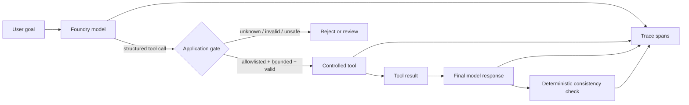

# From Agent Demo to Production Boundary: Making Tool Calling Trustworthy

**Canonical article:** `https://amrelsehemy.net/` *(publish this article on the website and replace with its final URL)*  
**Implementation:** [Agentic Engineering Lab](https://github.com/AmrElsehemy/agentic-engineering-lab)  
**Status:** Verified live against Microsoft Foundry and Azure Monitor on 3 October 2026

## The claim

Most agent examples prove that a model can call a function. That is useful, but it is not the production problem.

The production problem is whether the application can create a **trustworthy boundary between probabilistic model behavior and deterministic software behavior**.

This article focuses on one aspect of production-grade agent engineering:

> **Controlled tool execution: the model may propose an action, but application code decides whether that action is allowed, valid, observable, and safe to hand back to the model.**

This is deliberately narrower than claiming that a small repository is production-ready in every dimension. It does not solve distributed state, incident response, privacy review, load testing, or business authorization. It does establish and test one boundary that every serious agent system needs.

## Why another tool-calling demo is not enough

A typical demo looks like this:

1. Send a prompt to a model.
2. Give the model a function definition.
3. Execute whatever function it requests.
4. Send the result back.
5. Print the answer.

That proves an API integration. It does not answer the questions an engineering team asks before operating the system:

- Can the model invoke an unapproved tool?
- Can it make multiple calls when only one was intended?
- Are arguments bounded and validated before execution?
- Can a tool create a side effect without a human or policy decision?
- Can we distinguish a model response from a tool execution in telemetry?
- Can the final prose contradict the structured result?
- Can a regression test fail when the model changes behavior?
- Can we run the same control checks without calling a model?

The Agentic Engineering Lab treats those questions as the actual unit of work. The model is only one component in the loop.

## The production boundary

The first example uses a deliberately modest tool: `get_training_plan`.

It does not send an email, modify a CRM record, place an order, or write to a database. That is intentional. A bounded read-like planning tool makes the control boundary visible without hiding it behind irreversible side effects.



The important part is the application gate. The model does not receive authority merely because it produced syntactically valid JSON.

## Control 1: allowlist the tool surface

The tool surface is explicit. The example authorizes `get_training_plan` and rejects unknown tools before execution.

That distinction matters because tool definitions are not a security policy. They are instructions to a model. The application still needs its own policy boundary.

A useful production rule is:

> **Every tool call must pass an application-owned authorization check, even when the model was given the same tool in its prompt.**

This also creates a clean place to add policy later: tenant permissions, data classification, environment restrictions, approval requirements, and rate limits.

## Control 2: bound and validate arguments

The tool validates the arguments it receives:

- `athlete` and `goal` must be present and non-empty.
- `days_available` must be between 1 and 7.
- The goal is bounded before it reaches the model loop.
- The result contains exactly the requested number of sessions.

This is not about distrusting one model vendor. It is about treating model output as untrusted input, just as we would treat a request from a browser, webhook, or third-party integration.

The validation is also testable without a live model. That is a key design choice: the policy should not depend on model availability or prompt luck.

## Control 3: enforce a tool-call budget

The first example allows one tool call per turn. That is a small but meaningful operational control.

Without a budget, a model can produce multiple calls, duplicate work, or create a surprising fan-out. A production system may eventually need a richer budget—per request, per user, per workflow, and per tool—but the principle is the same:

> **Tool execution is a metered operation, not an unlimited side effect of generation.**

The application checks the count before executing the calls.

## Control 4: make the handoff observable

The execution emits structured events rather than relying on a single opaque log line:

```json
{"event":"model_response","tool_calls":[{"name":"get_training_plan"}]}
{"event":"tool_executed","tool":"get_training_plan","validated":true}
{"event":"model_response","phase":"final","tool_calls":[]}
{"event":"quality_check","name":"training_plan_consistency","passed":true}
```

In the live Microsoft Foundry run, the same loop was traced with Entra-authenticated Azure Monitor export:

```json
{"event":"observability_configured","backend":"azure-monitor"}
```

The trace is useful because it separates four different facts:

1. What the model proposed.
2. What the application allowed and executed.
3. What the model generated after receiving the tool result.
4. Whether a deterministic postcondition passed.

That separation is the beginning of diagnosability. If the final answer is wrong, the team can ask whether the model proposed the wrong call, the tool returned the wrong data, the handoff was malformed, or the final response contradicted the tool result.

## Control 5: test the final answer against structured truth

A subtle failure mode appears after the tool has executed successfully: the model can still describe a different result in its final prose.

For the training-plan example, the structured tool result contains `days_available`. The quality guard scans explicit schedule claims in the final response and rejects a contradiction such as:

```text
Tool result: 4 days
Final answer: a 5-day plan
```

This is not a complete quality evaluation. It is a deterministic postcondition for one important invariant.

The broader pattern is reusable:

- Tool result says the account is not eligible; final answer must not say it is eligible.
- Tool result says approval is pending; final answer must not imply execution completed.
- Tool result says inventory is zero; final answer must not promise shipment.
- Tool result says a deployment failed; final answer must not report success.

The exact invariant changes by domain. The architecture does not.

## Failure modes this boundary catches

The value of the controls becomes clearer when the failure modes are made explicit.

### The model requests an unknown tool

The model may hallucinate a function name, follow an outdated instruction, or receive a tool list that is broader than the current application policy. The allowlist rejects the call before execution. The result is a controlled failure rather than an accidental dispatch.

### The model supplies invalid arguments

Structured tool calls improve shape, but they do not guarantee acceptable values. A model can request seven sessions when a particular workflow permits three, send an empty goal, or exceed a bounded input size. Validation keeps those values at the application boundary.

### The model produces multiple calls

Multiple calls may be valid in a future workflow, but they should be an explicit design choice. The one-call budget makes accidental fan-out visible and fails closed. A later orchestration example can replace the budget with a state machine and per-step policy rather than silently relaxing the control.

### The final prose drifts from the tool result

This is easy to miss because the response may sound helpful. The consistency guard turns a semantic invariant into a testable event. It does not judge every sentence; it catches the specific class of contradiction that the application has declared unacceptable.

### Telemetry is unavailable or misconfigured

The Azure Monitor check is separate from the model-quality check. If tracing cannot initialize, the live evaluator fails with an infrastructure diagnosis rather than pretending that observability exists. This distinction matters operationally: a system can produce a correct answer while still being unsafe to operate if no one can reconstruct what happened.

## Why the first tool has no side effect

It is tempting to demonstrate production seriousness by connecting an agent directly to a real business system. That often makes the example less rigorous. A side effect introduces authorization, idempotency, rollback, audit, retry, privacy, and reconciliation questions all at once. If those are not designed, the demo creates the appearance of autonomy without the controls required to contain it.

The first tool therefore produces an educational plan and nothing else. This gives the repository a clean progression:

1. Prove the control boundary with a bounded tool.
2. Add routing and explicit specialist contracts.
3. Add human approval for actions that can change state.
4. Add persistence, idempotency, retries, and recovery.
5. Only then connect consequential business tools.

The absence of a side effect is not a weakness in the example. It is an explicit risk decision.

## What an operating team can reuse

The most reusable artifact is not the training-plan domain. It is the contract around execution. A team could replace `get_training_plan` with a pricing lookup, document classifier, deployment planner, or support-ticket triage tool while keeping the same control questions:

| Boundary question | Example implementation |
|---|---|
| Is the capability allowed? | Application-owned tool allowlist |
| Are inputs safe to process? | Type, range, length, and domain validation |
| How much work may happen? | Per-turn call budget |
| What happened? | Structured model, tool, final, and quality events |
| What must remain true? | Deterministic postcondition checks |
| Can operators investigate? | Entra-authenticated Azure Monitor traces |
| What happens with side effects? | Separate approval and authorization boundary |

This is why the article is useful beyond a demo. It provides a small, inspectable template for a control plane that can grow with the domain. The business tool changes; the burden of proof around that tool remains.

## What was actually verified

On 3 October 2026, the example was run against a Microsoft Foundry project using Microsoft Entra authentication and deployment `gpt-5.4-nano`.

The live evaluator passed:

```text
LIVE PASS forced tool selection
LIVE PASS validated tool execution
LIVE PASS final model response after tool result
LIVE PASS final-answer consistency
LIVE PASS observability configured: azure-monitor
EXIT_CODE=0
```

The run is evidence of a functioning controlled agent loop with Azure Monitor tracing. It is stronger than a screenshot of a fluent answer because the acceptance criteria are explicit and machine-checked.

The repository also contains dependency-free checks. The current suite passes 10 checks covering validation, authorization, approval boundaries, session consistency, and final-answer consistency.

## What this proves—and what it does not

### It proves

- The model can be forced to request a named structured tool.
- The application validates and authorizes the tool call.
- The controlled tool executes once within a bounded contract.
- The result is handed back to the model before the final response.
- A deterministic postcondition can reject contradictory final prose.
- The live loop can export structured telemetry through Azure Monitor using Entra credentials.
- The same control logic can be exercised without a live model.

### It does not prove

- Production readiness for arbitrary tools or domains.
- Correctness of every model answer.
- Authorization for real business side effects.
- Durable workflow state or distributed retries.
- Idempotency under duplicate delivery.
- Privacy, compliance, or data-retention approval.
- Load, latency, cost, or disaster-recovery characteristics.
- That a model should be trusted with unrestricted autonomy.

The limitation is part of the engineering claim. A credible production article should state the boundary of its evidence instead of converting one successful run into a universal readiness claim.

## Why this is useful to a team

This pattern gives an engineering team a practical starting point for incrementally hardening agents:

1. Start with one bounded tool.
2. Put authorization in application code.
3. Validate every argument.
4. Limit execution budgets.
5. Emit structured events.
6. Define one or more deterministic invariants.
7. Test the controls without a model.
8. Run the same loop live with real identity and telemetry.
9. Add side effects only after approval, idempotency, and recovery are designed.

That sequence turns “agentic AI” from a prompt experiment into an inspectable system boundary.

## The broader lesson

The interesting engineering question is not:

> “What can this agent do?”

It is:

> “What is this agent allowed to do, how do we know what happened, and what fails closed when the model is wrong?”

A production-grade agent is not defined by the number of tools it can call. It is defined by the quality of the boundaries around those tools.

This first lab example makes one boundary concrete. The next examples will extend the same reasoning to routing, human approval, orchestration, and eventually side-effecting workflows.

## Run it yourself

```bash
git clone https://github.com/AmrElsehemy/agentic-engineering-lab.git
cd agentic-engineering-lab

# Dependency-free demonstration
python examples/01-single-agent-tool-calling/agent.py \
  --demo --goal "prepare for a HYROX race"

# Deterministic control checks
python evaluate.py

# Live Foundry evaluation, after external environment configuration
python evaluate_live.py
```

For the external environment setup and Azure Monitor configuration, see the example README. Do not commit credentials, connection strings, or sensitive prompts.

## Continue the investigation

- [Single agent + controlled tool call](../../examples/01-single-agent-tool-calling/README.md)
- [Evaluation rubric](../evidence/evaluation-rubric.md)
- [Sanitized live trace](../evidence/live-foundry-agent-trace-2026-10-03.md)
- [Architecture map](../architecture-map.md)

**Canonical home:** publish this article at `https://amrelsehemy.net/` and use the GitHub page as the inspectable implementation companion.
